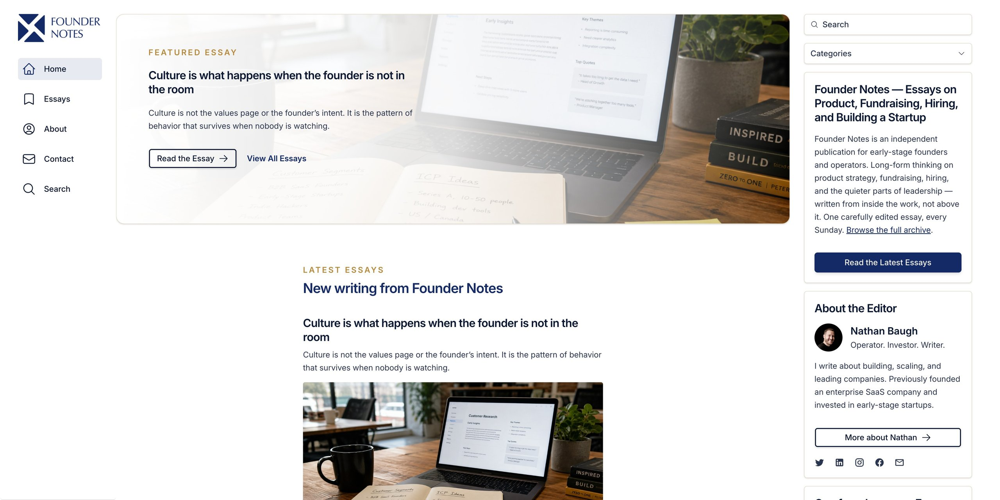

# Winx

[](https://winx.gallop.software)

A modern, AI-built blog and publishing template for writers, journalists, and content creators. Keep WordPress as your editor and authoring backend, then ship a blazing-fast headless Next.js front end that publishes at the speed of thought, outshines the competition, and ranks #1 on Google.

**🌐 Demo:** [winx.gallop.software](https://winx.gallop.software)  
**☁️ Cloudflare Demo:** [winx-cloudflare.gallop.software](https://winx-cloudflare.gallop.software/)  
**🎨 Template:** [gallop.software/templates](https://gallop.software/templates)  
**📦 Repository:** [github.com/gallop-software/winx](https://github.com/gallop-software/winx)  
**🏷️ Category:** Headless WordPress Blog Template

---

## Why Use Gallop Templates?

Keep the WordPress editor you already know — but escape the slow themes, plugin sprawl, and clunky front end. Winx goes **headless**: WordPress handles authoring, and a modern Next.js front end handles the experience your readers actually see. Just chat with AI inside our Gallop AI Editor, describe the post, layout, or feature you want, and AI writes the code. No page builders, no endless options fields, and no design limitations. Build beautiful article layouts, add smooth reading animations, configure your SEO and AI discoverability instantly, expand endlessly, and get prompting tips from our [Gallop community](https://gallop-software.slack.com/). Go live in minutes.

[](https://gallop.software/#learn-more)

---

## Features

- 🚀 **Next.js 16.2** with App Router
- ⚛️ **React 19** for cutting-edge performance
- 🎨 **Tailwind CSS 4.2** for pixel-perfect design
- 🔌 **Headless WordPress** - Keep WordPress as your authoring backend and serve a fast, decoupled Next.js front end
- 📚 **Rich blog archives** - Category, tag, author, and year pages built in
- 🗺️ **Auto-generated sitemaps** for pages, posts, authors, categories, and tags
- 🖼️ **Image processing** with automatic optimization
- 🔍 **Built-in search** powered by FlexSearch with Algolia Autocomplete
- 🔦 **Lightbox galleries** for post images and media
- 🎞️ **Swiper carousels** for image galleries and sliders
- 💬 **Share counts** powered by Prisma and Vercel KV cache
- ❤️ **Post likes & reactions** with persistent storage
- 📧 **Newsletter subscribe/unsubscribe** API endpoints
- 📝 **Form submission** API for contact and lead capture
- 📱 **Fully responsive** and mobile-optimized for readers
- ⚡ **Lightning-fast** page loads for long-form content
- 🎭 **Framer Motion** animations
- 🎯 **SEO and AI optimized** with article structured data
- 🤖 **AI-friendly** codebase structure
- 🛡️ **Gallop Canon** - AI guardrails for consistent, reliable code
- 🎨 **Iconify icons** (Heroicons, Lucide, Material Design, Simple Icons)
- ☁️ **Deploys to Vercel or Cloudflare Workers**
- 📊 **Vercel Analytics** integration

---

## Getting Started

New to this? No problem. You'll have AI guiding you the entire way.

### The Gallop AI Editor

The [Gallop AI Editor](https://gallop.software/) is a desktop app built specifically for AI-powered web development for Next.js. It includes everything you need — code editor, AI assistant, Git, terminal, media manager, font manager, SEO & structured data scanner, and a gallery of open-source templates — all in one window with nothing to configure.

It was purpose-built for this workflow, whether you're a first-time blogger or an advanced Next.js developer who wants AI-assisted development:

| | What you get |
|---|---|
| **Best for** | Writers, non-programmers, junior programmers, advanced programmers |
| **AI built in** | Claude ready to go — use Gallop AI with no setup, your Claude Max or Pro plan, or your own API key |
| **Template gallery** | Built in, and every template is free and open source |
| **Media manager** | Built-in Studio with CDN sync |
| **Font manager** | Built-in Studio with WOFF2 font generation |
| **SEO Audit** | Analyze SEO & Structured Data |
| **Git** | Git UI with modal diff viewer |
| **Node.js** | Built-in installer and version manager |
| **Deployment** | Connect Vercel or Cloudflare, then let AI deploy for you |

[](https://gallop.software/)

Available for Mac and Windows.

#### Step 1: Install Gallop AI Editor

1. Go to [gallop.software](https://gallop.software/) and download the installer for your platform
2. Open the installer and follow the prompts
3. Launch the Gallop AI Editor
4. If prompted, the editor will walk you through installing Node.js automatically — just follow the on-screen steps

#### Step 2: Create Your Project

Open the **New Project** modal. It has three tabs — **Gallop Templates**, **Git Repositories**, and **Local** — and you want the first one.

1. On the **Gallop Templates** tab, select **Winx** from the gallery
2. Name your new repository, and pick which GitHub account or organization owns it
3. Choose whether it's public or private
4. Pick the folder on your computer where it should live
5. Click create

The editor then does everything else in one pass:

- **Creates your own repository on GitHub** from the template — a clean repo that belongs to you, with no shared history tying it back to the original
- **Clones it to your machine** in the folder you picked, with a progress bar
- **Opens it as a project**, ready to run

Because the repository is created here, **your GitHub repo already exists** by the time you reach [Put Your Blog Online](#put-your-blog-online) — there's nothing to set up on GitHub when it's time to deploy.

> **Why this is one click:** you're already signed in to GitHub inside the editor, so it can create the repository on your behalf without asking you for anything.

#### Step 3: Start Your Blog

Click the **play icon** in the left rail (or press `Cmd+1`) to open the **Start Website** view. It's a terminal with a toolbar across the top — two clicks and your blog is live locally.

1. Click **Install** and wait for it to finish. This downloads everything the project needs, and takes a minute or two the first time.
2. Click **Start Website**. Your blog is now running at [http://localhost:3000](http://localhost:3000).
3. Click the **globe icon** in the top-right title bar to open your blog in a browser. Hover it and it tells you the port it's running on.

Here's the full toolbar, and the command each button saves you from typing:

| Button | What it does | Equivalent command |
|---|---|---|
| **Install** / **Reinstall** | Downloads the project's dependencies. Reads **Reinstall** once they're already installed. | `npm install` |
| **Start Website** | Starts the development server with hot reload — save a file and the browser updates itself. | `npm run dev` |
| **Stop** | Shuts the server down and frees up the port. Replaces **Start Website** while the site is running. | `Ctrl+C` |
| **Refresh Cache** | Clears Next.js's build cache and restarts the server. Only appears while running. | delete `.next`, restart |
| **Clear** | Wipes the terminal output. Doesn't touch the server. | `clear` |

The play icon in the left rail turns **green with a dot** while your blog is running, so you can tell at a glance from any view.

**Leave the server running while you work.** You only need **Start Website** once per session — the site refreshes on its own every time you or the AI saves a file.

**If something looks stuck** — a change won't appear, or the site won't load — try **Refresh Cache** first, and **Stop** then **Start Website** if that doesn't do it.

#### Step 4: Connect Your WordPress Content

Winx pulls posts, categories, tags, and authors from WordPress at build time. Point it at your WordPress site by setting `NEXT_PUBLIC_WORDPRESS_URL` in `.env.local` (copy `.env.local.sample` to start), then run `npm run blog` to fetch your content into `_data/`.

Or just ask the AI:

```
Connect this blog to my WordPress site at example.com and pull in my posts
```

See [Headless WordPress with Gallop WP](#headless-wordpress-with-gallop-wp) for what the WordPress side needs. Without a WordPress URL the blog still builds — it just renders with no posts.

#### Step 5: Chat with AI

Press `Cmd+J` to show the AI panel on the right. Click the **+** in its header and you'll get a picker with three cards:

| Card | What it is |
|---|---|
| **AI Chat** | Gallop's own chat interface — message bubbles, plan mode, and the target for screenshots you insert. Start here. |
| **Claude Code** | Claude Code itself, running as a terminal inside the panel. |
| **Terminal** | A plain shell, for when you want to run something yourself. |

**Both AI options are Claude Code.** Gallop's AI Chat runs Claude Code under the hood and puts a friendlier interface on top of it; the Claude Code card gives you the same engine as its normal terminal interface. Same capabilities, same access to your project — pick whichever you find easier to read.

- **New to this?** Use **AI Chat**. Answers render as formatted text, file changes are easier to follow, and screenshots insert straight into the conversation.
- **Already use Claude Code?** Use the **Claude Code** card. Everything works the way you're used to, including slash commands and your existing habits.

You can run both at once in separate tabs — they're independent sessions.

Pick **AI Chat**, then just ask:

```
I'm new to this. Help me customize this blog for my niche.
```

The AI assistant can read and edit your project files, run commands, and explain anything you're confused about. Just describe what you want in plain English:

```
Change the site name in the header to Founder Notes
```

```
Make the accent color a warm terracotta
```

```
Add a newsletter signup block to the bottom of every post
```

```
Optimize the SEO and article structured data on my latest post
```

**Tip:** Press `Cmd+Shift+S` to take a screenshot of your running blog and attach it to the chat. The AI can see exactly what you see and suggest changes visually.

---

## Working in the Editor

Everything below is how you actually build your blog day to day. The left rail switches between views; each has a keyboard shortcut.

| Icon | View | Shortcut | What it's for |
|---|---|---|---|
| ▶ | **Start Website** | `Cmd+1` | Run your blog locally. Install, Start, Stop, Refresh Cache — see [Step 3](#step-3-start-your-blog). Turns green while running. |
| ⑂ | **Source Control** | `Cmd+2` | Commit, branch, and merge visually. The badge shows how many files changed. |
| `<>` | **Editor** | `Cmd+3` | The code editor, with autocomplete and go-to-definition. `Cmd+B` toggles the file explorer. |
| 🖼 | **Studio** | `Cmd+4` | Your images and fonts — see below. |
| 🌐 | **SEO** | `Cmd+5` | Scan any page for SEO and structured-data problems. |
| 🚀 | **Publish** | `Cmd+6` | Connect Cloudflare, Vercel, and Mailgun so AI can deploy for you. |

`Cmd+K` cycles forward through views if you'd rather not remember numbers.

### The AI Panel

The AI panel lives on the right and is where most of your work happens.

- `Cmd+J` shows and hides it. Hiding does **not** stop what's running — a long AI task keeps going while the panel is closed.
- `Cmd+I` expands it to fill the window, for when you're reading a long answer.
- `Cmd+T` opens a new tab; `Cmd+Shift+[` and `Cmd+Shift+]` cycle between them. You can drag tabs to reorder them.
- Every tab has a `×`. Close the last one and you're back at the AI Chat / Claude Code / Terminal picker.

**Agent mode vs Plan mode** — on an AI Chat tab, press `Cmd+.` to switch between them. (Claude Code tabs have their own mode controls, so `Cmd+.` doesn't apply there.)

| Mode | Behavior | Use it when |
|---|---|---|
| **Agent** | AI edits your files directly. | You trust the change — most of the time. |
| **Plan** | AI describes what it intends to do and waits for your approval. | The change is large or you want to learn what it's doing. |

Two AI Chat slash commands are worth knowing: `/new` starts a fresh conversation, and `/compact` summarizes a long one so you can keep going without losing the thread.

**How you pay for AI** is set in the panel's settings gear. There are three options, and none of them require you to have an API key:

| Option | What it uses | Good for |
|---|---|---|
| **Gallop AI** | Our proxy, billed from a prepaid balance | Getting started — nothing to sign up for or configure |
| **Subscription** | Your existing **Claude Max or Pro** plan | You already pay Anthropic monthly and want to use that |
| **Your API Key** | Your own Anthropic API key | You'd rather be billed by Anthropic per request |

Sessions pick up this setting when they start, so change it *before* opening a chat tab.

### Showing AI What You See

Describing a visual bug is hard. Show it instead.

- `Cmd+Shift+S` — drag a box around any part of your running blog. The capture opens in an annotator where you can draw arrows and boxes, then **Insert** it straight into a chat tab.
- `Cmd+Shift+G` — opens the code file behind whatever page your browser is showing. No hunting through folders to find which file draws a page.
- `Cmd+Shift+L` — drops the file you're editing into the chat as a reference, so you can say "fix the spacing here" without explaining where "here" is.

### Studio: Images and Fonts

`Cmd+4` opens Studio, which manages everything in your `public/` folder.

- Drop in images and it generates thumbnails and blur placeholders automatically
- Crop and edit without leaving the editor
- Push assets to a CDN so they load fast worldwide
- Drop in a font and it converts to WOFF2, the format browsers load fastest

Studio keeps its records in `_data/_studio.json`. That file is generated — let Studio manage it.

### SEO

`Cmd+5` opens the SEO view. You run a report yourself — the AI can't trigger one for you:

1. Type or paste the URL you want to check (your local site works: `http://localhost:3000`)
2. Pick a report from the dropdown
3. Click **Analyze**

| Report | What it tells you |
|---|---|
| **Analyze On-Page SEO** | Titles and descriptions, each rated from "Missing" through "Too long" so you can see what to tighten |
| **HTML vs DOM** | What search engines receive versus what loads in the browser — catches content that only appears after JavaScript runs |
| **Analyze Structured Data** | Whether the JSON-LD that search engines and AI assistants read is valid |

Each report opens in its own tab, so you can check several posts side by side.

Once you have the results, hand them to AI: screenshot the report with `Cmd+Shift+S` and insert it into a chat, or paste the details in. Then ask for what you want:

```
Here's the SEO report for my latest post. Fix everything it flags.
```

### Source Control

`Cmd+2` gives you Git without the command line — stage individual lines, review diffs side by side, and browse history. If you'd rather not think about Git at all, don't: ask AI to "commit my changes and push them."

### Keyboard Shortcuts

| Shortcut | Action |
|---|---|
| `Cmd+1`–`Cmd+6` | Switch views |
| `Cmd+K` | Cycle views forward |
| `Cmd+J` | Show/hide the AI panel |
| `Cmd+I` | Expand/collapse the AI panel |
| `Cmd+.` | Toggle agent ↔ plan mode |
| `Cmd+T` | New tab |
| `Cmd+W` | Close tab |
| `Cmd+Shift+[` / `]` | Cycle tabs |
| `Cmd+B` | Toggle file explorer |
| `Cmd+P` | Quick Open — jump to any file by name |
| `Cmd+F` | Find |
| `Cmd+Shift+F` | Find in all files |
| `Cmd+S` | Save |
| `Cmd+Shift+S` | Screenshot |
| `Cmd+Shift+G` | Open the route file for your browser's page |
| `Cmd+Shift+L` | Send the current file to chat |
| `Cmd+Shift+N` | New window |

On Windows, use `Ctrl` wherever this says `Cmd`.

---

### Join the Community

Connect with other Gallop users on Discord or Slack. Share your progress, swap AI prompting tips, and see how non-programmers are launching blogs that once required a full editorial team.

[](https://discord.gg/jJw8xrhFj)
[](https://gallop-software.slack.com/)

---

## Put Your Blog Online

Your code is already on GitHub — you're signed in inside the editor, and your repository was created when you started the project. All that's left is a hosting account: either [Vercel](https://vercel.com/pricing) or [Cloudflare](https://www.cloudflare.com/plans/developer-platform/). Check their current plans before you pick — pricing and what each tier allows change over time.

Winx also expects a Postgres database and a Redis/KV store for post likes and share counts, plus Mailgun for the contact form. Those are covered by the environment variables in `.env.production.sample`; the AI can walk you through provisioning them.

### The Easy Way: Let AI Deploy It

Press `Cmd+6` (the rocket icon) to open the **Publish** view. It has a tab for each service you might need:

| Tab | What it's for |
|---|---|
| **Cloudflare** | Deploy to Cloudflare Workers |
| **Vercel** | Deploy to Vercel |
| **Mailgun** | Sends the email from your contact form |

Each tab links straight to the page where you generate the token, with the right permissions preselected — you paste it in, click **Connect** to verify it, then **Save**.

From then on the editor injects those credentials into your terminal and AI chat automatically, so the assistant can deploy on your behalf and **you never paste a token into a project file**.

> **Important:** credentials are handed to a session when it starts. After saving a new token, open a **new** chat or terminal tab — an existing one won't see it.

Then just ask:

```
Push my latest changes to GitHub and deploy this blog
```

The AI will walk you through every step. When you're done, your blog will be live with a URL you can share.

Already know which host you want? Use the ready-made prompt for [Vercel](#deploy-to-vercel) or [Cloudflare](#deploy-to-cloudflare-workers).

### Deploy to Vercel

Connect your Vercel account in the Gallop AI Editor, then paste this into the AI chat:

```
Deploy this blog to Vercel. My Vercel account is already connected.

Please:
1. Push my latest changes to GitHub
2. Link this project to Vercel and deploy it to production
3. Ask me for my WordPress URL, database, KV, and Mailgun values, then add
   them as environment variables (see .env.production.sample for the full list)
4. Tell me the live URL when it's done

Never commit .env.production — it holds real secrets.
```

Vercel redeploys automatically every time you push, so from here on your changes go live by asking the AI to push them.

**Environment variables, without the busywork.** The Vercel tab in the Publish view can push and pull your `.env` files against your Vercel project directly. Change a value locally, push it up; pull production values down to check them. It shows you a full diff before anything is written, and backs up your local file before a pull.

Congratulations! Your blog is now live to the world. Share your new URL and start growing your readership. Ready for a custom domain? See [Vercel's domain setup guide](https://vercel.com/docs/projects/domains).

### Deploy to Cloudflare Workers

Prefer Cloudflare? Winx also runs on Cloudflare Workers via the [OpenNext](https://opennext.js.org/cloudflare) adapter. See it live: **[winx-cloudflare.gallop.software](https://winx-cloudflare.gallop.software/)** — the same template, deployed exactly the way this section describes.

**Step 1 — Connect Cloudflare in the Publish view** (`Cmd+6`). Once saved, the editor puts your Cloudflare credentials (`CLOUDFLARE_API_TOKEN` and `CLOUDFLARE_ACCOUNT_ID`) into the terminal environment and makes them available to the AI chat. Wrangler reads those variables automatically, which means **nobody has to run `npx wrangler login`, and no token is ever pasted into a file.**

**Step 2 — Paste this prompt into the AI chat:**

```
Deploy this blog to Cloudflare Workers. My Cloudflare account is already
connected, so CLOUDFLARE_API_TOKEN and CLOUDFLARE_ACCOUNT_ID are in the
terminal environment — do not run `wrangler login`.

Please:
1. Run `npm run cf:setup` to create .env.production from the sample
2. Ask me for my production URL, WordPress URL, database, KV, and Mailgun
   values, then fill in .env.production
3. Run `npm run cf:deploy` to build and create the Worker
4. Run `npm run cf:secrets` to upload the secrets
5. Tell me the live URL when it's done

Never commit .env.production — it holds real secrets.
```

The AI will pause at step 2 to collect your values. Everything else runs unattended. First deploy takes a few minutes.

**Step 3 — Follow-up prompts** for anything after the first deploy:

```
Deploy my latest changes to Cloudflare
```

```
I changed my Mailgun API key in .env.production — push the updated secrets to Cloudflare
```

```
Rename my Cloudflare Worker to my-blog and redeploy
```

```
My contact form isn't sending email on Cloudflare — check my secrets are set correctly
```

**If a prompt fails,** paste the error back into the chat. The most common causes are a Cloudflare account that isn't connected yet (so wrangler has no credentials) and running `cf:secrets` before the Worker exists — the AI can diagnose both from the error text.

#### Reference: How the Cloudflare Deployment Works

Everything below is **reference material for your AI assistant** — what files Cloudflare needs, which ones get created, and what has to change when you rename things. You don't need to read or run any of it yourself; the prompts above cover the whole process. It's here so the AI has accurate ground truth, and so you have something to point at if a deploy goes wrong.

##### The Three Kinds of Cloudflare Files

Winx ships Cloudflare-ready. **If you forked or generated this repo, every config file already exists — you do not create any of them.** The only file you add by hand is `.env.production`.

**1. Config files — already in the repo, keep them**

| File | What it does for Cloudflare |
|---|---|
| `wrangler.jsonc` | The Worker manifest. Names the Worker, points at the build output, declares bindings and the `nodejs_compat` flag. Wrangler reads this on every command. |
| `open-next.config.ts` | Tells the OpenNext adapter how to convert the Next.js build into a Worker. Ships minimal — the R2 incremental cache is commented out and off. |
| `next.config.mjs` | Its last line calls `initOpenNextCloudflareForDev()`, which makes Cloudflare bindings available during `npm run dev`. It is a no-op in production builds, so **this does not break Vercel**. It also traces `pg-cloudflare/dist` so the Postgres driver bundles for Workers. |
| `package.json` | Holds the `cf:*` scripts plus `@opennextjs/cloudflare`, `wrangler`, and `pg-cloudflare`. |
| `.env.production.sample` | Placeholder copy of the secrets you'll need. Safe to commit — it contains no real values. |

**2. Files you create — never committed**

| File | How to create it | Why |
|---|---|---|
| `.env.production` | `npm run cf:setup` (copies the sample) | Real secret values. `npm run cf:secrets` reads this file and uploads its contents to Cloudflare's secret store. |
| `.dev.vars` | Created automatically by `npm run cf:preview` | Local-preview copy of your secrets, the format the Workers runtime expects. |

Both are covered by the `.env*` and `.dev.vars*` rules in `.gitignore`, so they stay out of Git automatically. **Never commit either one.**

**3. Build output — generated, never commit**

| Path | Created by |
|---|---|
| `.open-next/` | `npm run cf:build` — contains `worker.js` and the static `assets/` that `wrangler.jsonc` points at |
| `.wrangler/` | Wrangler's local state and cache |
| `cloudflare-env.d.ts` | `npm run cf:typegen` — TypeScript types for your bindings |

All three are already gitignored. `.open-next/` does not exist until you build, which is why `cf:deploy` and `cf:preview` always run the build first.

##### The Deployment Sequence

This is what the AI runs on your behalf, in this order:

```bash
npm run cf:setup     # scaffolds .env.production
# fill in .env.production with your values
npm run cf:deploy    # build + deploy — creates the Worker on first run
npm run cf:secrets   # push .env.production to the Worker's secret store (after the Worker exists)
```

No `wrangler login` step is needed: connecting Cloudflare in the editor already put `CLOUDFLARE_API_TOKEN` in the environment, and wrangler picks it up automatically.

Order matters: `cf:secrets` cannot create a Worker, so deploy once first. After that, secrets and code are independent — you only re-run `cf:secrets` when a value changes, and every later deploy reuses them.

**How `cf:secrets` finds the right Worker:** it runs `wrangler secret bulk .env.production`, which targets your authenticated Cloudflare account plus the Worker named in `wrangler.jsonc` — no URL involved. It uploads *every* key in the file, `NEXT_PUBLIC_*` values included; those are harmless as secrets but have no effect, because `NEXT_PUBLIC_*` is inlined at build time rather than read at runtime.

- **Authenticate first.** Either set `CLOUDFLARE_API_TOKEN` in your environment (what the Gallop AI Editor does for you when you connect Cloudflare) or run `npx wrangler login` for OAuth, cached in `~/.wrangler`. If your account can't be inferred from the token, also set `CLOUDFLARE_ACCOUNT_ID`. Wrangler ships as a dev dependency, so `npx` runs the local copy — no global install needed. Without auth, `cf:secrets` and `cf:deploy` can't reach Cloudflare.
- **Names must match.** The `name` in `wrangler.jsonc` must equal the Worker's actual name in your dashboard. If a Git-connected deploy created it under a different name, update `wrangler.jsonc` to match — otherwise `cf:secrets` pushes to a nonexistent Worker.
- **`NEXT_PUBLIC_WORDPRESS_URL` must be set at build time.** Posts are fetched from WordPress by `npm run blog` during `cf:build`, so if it's missing the Worker deploys with an empty blog.

##### ISR and On-Demand Revalidation

`open-next.config.ts` ships without an incremental cache, so on Workers the `revalidate` values throughout the app and the `/api/revalidate` endpoint are **no-ops** — pages are served exactly as built, and new WordPress posts appear on the next deploy rather than on a timer. On Vercel, ISR works normally.

To turn ISR on for Workers, create an R2 bucket, bind it in `wrangler.jsonc` as `NEXT_INC_CACHE_R2_BUCKET`, and uncomment the two `r2IncrementalCache` lines in `open-next.config.ts`. See [OpenNext's caching docs](https://opennext.js.org/cloudflare/caching).

##### Renaming the Worker

`wrangler.jsonc` ships with the Worker named `winx`. If you rename it, **two values must change together**:

```jsonc
{
  "name": "your-blog-name",           // ← 1. the Worker name
  "services": [
    {
      "binding": "WORKER_SELF_REFERENCE",
      "service": "your-blog-name"     // ← 2. must be identical to "name"
    }
  ]
}
```

`WORKER_SELF_REFERENCE` is how the Worker calls itself, which OpenNext relies on. If the two strings drift apart, the deploy succeeds and the site fails at runtime — a confusing failure worth avoiding.

##### Git-Connected Builds

If you connect the repo in the Cloudflare dashboard instead of deploying from your machine:

- **Build command:** `npm run cf:build`
- **Deploy command:** `npx opennextjs-cloudflare deploy` (the same command `npm run cf:deploy` uses)
- **Build variables:** set `NEXT_PUBLIC_PRODUCTION_URL` and `NEXT_PUBLIC_WORDPRESS_URL` here. Anything prefixed `NEXT_PUBLIC_` is inlined into the JavaScript at build time, so it must exist as a *build* variable — a runtime secret is too late. The WordPress URL is also what the build fetches posts from.
- **Secrets:** `DATABASE_URL`, `KV_*`, and `MAILGUN_*` values are read at runtime, so `npm run cf:secrets` (or the dashboard's secret UI) covers them. They do not belong in build variables.

Custom domains live under the Worker's **Settings → Domains & Routes**.

##### Workers Runtime Constraints

Workers is not Node.js, and three limits shape how you write code for it:

- **There is no filesystem.** `fs.readFileSync(process.cwd() + '/_data/...')` and `fs.readdirSync` either throw `ENOENT` or silently return empty, so a page vanishes or a route 500s with no obvious cause. Always import generated JSON through the `@/../_data/*` path so it is bundled at build time, and add a `_scripts/` generator if the data doesn't exist yet. This is an enforced Canon rule; see `CLAUDE.md`.
- **`nodejs_compat` is required.** The flag in `wrangler.jsonc` provides the Node APIs Next.js expects. Removing it breaks the build.
- **Postgres goes over `pg-cloudflare`.** Under the `workerd` build condition, `pg` (used by `@prisma/adapter-pg`) swaps its TCP socket for Cloudflare's. `next.config.mjs` traces that package's `dist` so the bundler can resolve it — removing either the dependency or the `outputFileTracingIncludes` entry breaks `npm run cf:build`.

##### Quick Reference

| Command | What it does |
|---|---|
| `npm run cf:setup` | Scaffold `.env.production` from the sample |
| `npm run cf:build` | Regenerate blog and page data, then build the Worker into `.open-next/` |
| `npm run cf:preview` | Build and run the real Workers runtime locally |
| `npm run cf:deploy` | Build and deploy to Cloudflare |
| `npm run cf:upload` | Build and upload a new Worker version without making it live (staged rollouts) |
| `npm run cf:secrets` | Push `.env.production` to the Worker's secret store |
| `npm run cf:typegen` | Regenerate `cloudflare-env.d.ts` from your bindings |

### Winx Pro

Want access to all premium blocks and post layouts? [Purchase Winx Pro](https://gallop.software/code/winx/blocks#pricing) and clone from the Pro repository, which includes all Pro blocks ready to use.

---

## About Gallop Templates

Winx is part of the [Gallop](https://gallop.software) template ecosystem. Gallop templates are designed to be built with AI — just describe what you want in plain English and watch your blog come to life.

### Gallop AI Editor

The [Gallop AI Editor](https://gallop.software/) is a desktop code editor built specifically for AI-powered web development. It combines a full code editor, Claude AI assistant, visual Git interface, integrated terminal, media manager, font manager, and template gallery into one app. Everything is preconfigured to work with Gallop templates out of the box — no extensions, no plugins, no setup.

**Key highlights:**

- **Claude AI built in** — Chat with Claude to write posts, debug issues, and learn as you go, with the latest Claude models available out of the box
- **Agent and Plan modes** — Agent mode lets AI apply changes automatically. Plan mode shows you what AI wants to do before it does it, so you stay in control
- **Screenshot capture** — Press `Cmd+Shift+S` to screenshot your running blog and share it with AI for visual feedback
- **Built-in template gallery** — Browse the Gallop templates, all free and open source, and start one in a single click: your own GitHub repository created and cloned locally without leaving the editor
- **Visual Git** — Stage, commit, and merge with a 3-column visual interface. No command line required
- **Studio media manager** — Manage post images, fonts, and assets with thumbnail previews and CDN sync
- **Node.js manager** — Install and switch Node.js versions without touching the terminal
- **Auto-updates** — The editor keeps itself up to date automatically

### Gallop Canon: AI Guardrails

Every Gallop template includes `@gallop.software/canon`, a system of ESLint rules and AI instructions that keep your AI assistant on track. Canon ensures:

- **Consistent architecture** - AI follows the same patterns across your entire codebase
- **No breaking changes** - Guardrails prevent AI from introducing common mistakes
- **Faster writing and publishing** - AI already knows the project structure, components, and conventions
- **Quality code** - Enforced best practices for performance, SEO, AI discoverability, and maintainability

Think of Canon as training wheels that never come off. AI stays within proven patterns, so you get reliable results every time.

**Canon Commands:**

- `npm run check` - Run lint and TypeScript checks together
- `npm run audit` - Audit the project against Canon's architecture patterns

### Headless WordPress with Gallop WP

Already invested in WordPress? Keep it. Winx pairs with the free [Gallop WP](https://gallop.software/headless-wordpress) plugin to turn your WordPress site into a headless authoring backend for this Next.js front end — so editors keep the admin they know while readers get a fast, modern, decoupled experience.

Gallop WP exposes a purpose-built REST API (`/wp-json/gallop/v1`) shaped for Next.js, so your front end stays simple:

- **One request per page** — resolve a front-end URI straight to a post or category and get the post body, SEO block, and site data back in a single round trip, instead of chaining multiple core WordPress REST calls
- **Built-in authentication** — cookie-based login, session, and logout endpoints with out-of-the-box brute-force rate limiting, so you can build membership and gated content without wiring up a JWT layer
- **UI-driven custom post types** — register REST-enabled custom post types from the WordPress admin with no `register_post_type()` boilerplate
- **Yoast SEO integration** — when Yoast is active, canonical URLs, meta descriptions, OpenGraph fields, and robots flags flow straight into the API response
- **Optional front-end redirect** — point Gallop at your production Next.js URL and it 301-redirects public WordPress requests to the matching headless path, while leaving the admin, REST API, and previews untouched

Winx reads WordPress through the standard `/wp-json/wp/v2` endpoints too, so the plugin is a recommendation rather than a hard requirement.

### Built for SEO and AI Discoverability

This template was crafted from the ground up to get your articles ranked #1 on Google and cited by AI assistants like ChatGPT and Google's Gemini. The software architecture, semantic HTML structure, article metadata system, and structured data are optimized for both search engine crawlers and AI models that surface content to readers.

AI citations are becoming more important than traditional SEO. When someone asks an AI assistant a question, you want your post to be the source it quotes. Gallop templates ship with the Article, BlogPosting, and Author structured data that AI models rely on to understand and surface your writing. Writers using this template are already ranking on Google and getting discovered by AI assistants.

### What You Can Build

- **Publish with AI** - Let AI draft, edit, and format posts while you provide the ideas and voice
- **Skip the boring work** - Let AI help with SEO, image optimization, tags, and tedious metadata updates
- **Pixel-perfect article design** - TailwindCSS integration for rapid styling without leaving component files
- **Automate workflows** - AI-powered scripts for sitewide SEO improvements, search indexing, and content updates
- **Get found online** - Battle-tested foundation with article structured data for search engines and AI assistants
- **Deploy instantly** - Next.js architecture on Vercel or Cloudflare Workers for cheap, fast hosting

### Built by Industry Veterans

The [team](https://webplant.media) behind Gallop has decades of combined experience building websites, apps, and web applications for top global brands. We've helped publishers achieve #1 Google rankings in competitive markets and understand what it takes to build world class editorial sites. That expertise is baked into every template, every component, and every line of code.

---

## Project Structure

```
winx/
├── src/
│   ├── app/                    # Next.js App Router
│   │   ├── (default)/         # Default layout route group
│   │   │   ├── layout.tsx
│   │   │   ├── page.tsx       # Blog home / latest posts
│   │   │   ├── not-found.tsx
│   │   │   ├── _blocks/       # Home page blocks
│   │   │   ├── [year]/        # Yearly archive
│   │   │   │   └── [month]/
│   │   │   │       └── [slug]/  # Single post
│   │   │   ├── author/[slug]/  # Author archives
│   │   │   ├── category/[slug]/ # Category archives
│   │   │   ├── tag/[slug]/    # Tag archives
│   │   │   ├── essays/        # Post archive listing
│   │   │   ├── search/        # Search results page
│   │   │   ├── about/
│   │   │   └── contact/
│   │   ├── (demo)/            # Block catalog demo
│   │   │   └── block/[[...slug]]/
│   │   │       └── _block-index.ts  # Generated by npm run blocks
│   │   ├── api/               # API routes
│   │   │   ├── blog-likes/    # Post likes
│   │   │   ├── share-count/   # Share counts
│   │   │   ├── posts/         # Filtered post listing
│   │   │   ├── subscribe/     # Newsletter signup
│   │   │   ├── unsubscribe/
│   │   │   ├── submit-form/   # Contact form handler
│   │   │   └── revalidate/    # On-demand revalidation
│   │   ├── global-error.tsx   # Error boundary
│   │   ├── global-not-found.tsx # 404 page
│   │   ├── layout.tsx         # Root layout
│   │   ├── metadata.tsx       # Site metadata
│   │   ├── robots.ts          # Robots.txt config
│   │   ├── sitemap_index.xml/ # Sitemap index
│   │   ├── *-sitemap.xml/     # page, post, author, category, tag sitemaps
│   │   └── *.png, *.ico       # App icons and favicon
│   ├── components/            # React components
│   │   ├── blog/             # Blog listing components
│   │   ├── footer/           # Footer config and components
│   │   ├── form/             # Form components
│   │   ├── lightbox/         # Lightbox gallery for post images
│   │   ├── search/           # Search components
│   │   ├── sidebar-stack/    # Sidebar panel stack
│   │   ├── navigation.tsx    # Main navigation
│   │   ├── page-wrapper.tsx  # Page wrapper with structured data
│   │   ├── button.tsx
│   │   ├── gallery.tsx
│   │   ├── heading.tsx
│   │   ├── image.tsx
│   │   ├── section.tsx
│   │   ├── share-bar.tsx
│   │   └── ...
│   ├── fonts/                # Font configuration files
│   ├── hooks/                # Custom React hooks
│   ├── styles/               # Global styles
│   │   └── tailwind.css     # Tailwind CSS entry
│   ├── tools/                # Route/slug helpers for sitemaps
│   ├── utils/                # Helper functions (prisma, kv, search, SEO)
│   └── state.ts              # Global state management
├── prisma/                    # Prisma schema (likes, share counts)
├── public/
│   ├── favicon.png           # Favicon
│   ├── images/               # Processed images
│   ├── screenshot.jpg        # Featured image
│   ├── search-index.json    # FlexSearch index (generated)
│   └── _headers             # Cloudflare header rules
├── _fonts/                   # Font source files (managed by Studio)
├── _data/                    # Generated metadata — never edit by hand
│   ├── _blog.json           # Post metadata (npm run blog)
│   ├── _taxonomies.json     # Categories, tags, authors (npm run blog)
│   ├── _pages.json          # Page routes for the sitemap (npm run pages)
│   └── _studio.json         # Studio media metadata
├── _scripts/                 # Build scripts (Node-only, not imported at runtime)
│   ├── generate-blog-metadata.mjs
│   ├── generate-page-metadata.mjs
│   ├── generate-block-index.mjs
│   ├── generate-search.mjs
│   ├── bust-kv-cache.mjs
│   └── *.md                 # Docs for each script
├── next.config.mjs          # Next.js configuration
├── open-next.config.ts      # Cloudflare Workers adapter config
├── wrangler.jsonc           # Cloudflare Worker manifest
├── prisma.config.ts         # Prisma CLI config
├── tsconfig.json            # TypeScript config
├── postcss.config.js        # PostCSS config
├── package.json             # Dependencies & scripts
├── knip.config.js           # Unused file detection config
├── eslint.config.mjs        # ESLint config
├── CLAUDE.md                # AI instructions (Canon patterns)
├── .env.local.sample        # Local env template
├── .env.production.sample   # Production env template
└── .prettierrc              # Prettier config
```

---

## Available Scripts

### Development

- **`npm run dev`** - Start development server at http://localhost:3000
- **`npm run build`** - Build for production (runs blog and page metadata first)
- **`npm run start`** - Start production server
- **`npm run lint`** - Run ESLint on all source files
- **`npm run lint:file`** - Run ESLint on a specific file
- **`npm run lint:gallop`** - Run the Gallop Canon rules on blocks as warnings
- **`npm run lint:next`** - Run ESLint with the three strictest Canon rules disabled
- **`npm run ts`** - TypeScript type checking without emitting
- **`npm run prettier`** - Format all files with Prettier
- **`npm run unused`** - Find unused files with knip
- **`npm run check`** - Run lint and TypeScript together

### Gallop Canon

- **`npm run audit`** - Audit codebase with Gallop Canon
- **`npm run audit:strict`** - Strict audit mode
- **`npm run audit:json`** - Output audit results as JSON

### Content & Assets

- **`npm run blog`** - Fetch WordPress posts and taxonomies into `_data/` → [docs](./_scripts/generate-blog-metadata.md)
- **`npm run pages`** - Scan page routes into `_data/_pages.json` for the page sitemap → [docs](./_scripts/generate-page-metadata.md)
- **`npm run search`** - Build FlexSearch index for site search → [docs](./_scripts/generate-search.md)
- **`npm run blocks`** - Regenerate the demo block index (`_block-index.ts`) → [docs](./_scripts/generate-block-index.md)
- **`npm run bust:kv`** - Bust the KV cache for likes and share counts → [docs](./_scripts/bust-kv-cache.md)

### Cloudflare Deployment

Your AI assistant runs these for you — see [Deploy to Cloudflare Workers](#deploy-to-cloudflare-workers).

- **`npm run cf:setup`** - Create `.env.production` from the sample
- **`npm run cf:build`** - Build the Worker into `.open-next/`
- **`npm run cf:preview`** - Build and run the Workers runtime locally
- **`npm run cf:deploy`** - Build and deploy to Cloudflare
- **`npm run cf:upload`** - Build and upload a version without making it live
- **`npm run cf:secrets`** - Push `.env.production` to the Worker's secret store
- **`npm run cf:typegen`** - Regenerate `cloudflare-env.d.ts` from your bindings

### Database

- **`npm run db:generate`** - Regenerate the Prisma client
- **`npm run db:migrate`** - Run Prisma migrations in development

### Package Management

- **`npm run update:check`** - Check for package updates
- **`npm run update:patch`** - Update to latest patch versions
- **`npm run update:minor`** - Update to latest minor versions
- **`npm run update:major`** - Update to latest major versions
- **`npm run update:interactive`** - Interactively choose updates
- **`npm run update:doctor`** - Update and test changes incrementally

### Maintenance

- **`npm run refresh`** - Remove node_modules and .next, then reinstall
- **`npm run clean`** - Remove node_modules, .next, and package-lock.json, then reinstall

---

## Technologies

### Frontend (Runtime)

Every dependency is battle-tested in production and chosen for stability, performance, and long-term maintainability.

- **Next.js** `16.2.4` - React framework with App Router
- **React** `19` - UI library
- **React DOM** `19.2.5` - React rendering
- **Tailwind CSS** `4.2.2` - Utility-first CSS framework
- **Headless UI** `2.2.10` - Unstyled accessible components
- **Prisma** `7.2.0` - Database ORM for likes and share counts
- **Vercel KV** `3.0.0` - Cache for likes and share counts
- **Valtio** `2.3.1` - State management
- **Swiper** `12.1.4` - Modern slider/carousel for post galleries
- **Yet Another React Lightbox** `3.31.0` - Image gallery for post media
- **FlexSearch** `0.8.212` - Full-text post search
- **Algolia Autocomplete** `1.19.8` - Search autocomplete
- **Framer Motion** `12.38.0` - Animation library
- **Luxon** `3.7.2` - DateTime library for post dates
- **React Intersection Observer** `10.0.3` - Scroll-based animations and lazy loading
- **React Highlight Words** `0.21.0` - Search result highlighting
- **html-react-parser** `6.0.1` - HTML-to-React parsing for WordPress content
- **Iconify Icons** - Icon sets (Heroicons, Lucide, Material Design, Simple Icons)
- **clsx** `2.1.1` - Conditional className utility
- **Vercel Analytics** `1.6.1` - Analytics integration
- **Next Third Parties** `16.2.4` - Third-party script optimization
- **OpenNext Cloudflare** `1.20.2` - Adapter for deploying to Cloudflare Workers
- **pg-cloudflare** `1.4.0` - Cloudflare TCP socket for Postgres on Workers

### Development

Tools for building and developing the blog:

- **TypeScript** `5` - Type safety and IntelliSense
- **ESLint** `9` - Code linting
- **ESLint Config Next** `16.2.4` - Next.js lint rules
- **Prettier** `3.8.3` - Code formatting
- **Prettier Plugin Organize Imports** `4.3.0` - Auto-organize imports
- **Prettier Plugin Tailwindcss** `0.7.2` - Sort Tailwind classes
- **PostCSS** `8.5.10` - CSS transformations
- **Knip** `5.88.1` - Unused file and export detection
- **Prisma CLI** `7.2.0` - Migrations and client generation
- **Wrangler** `4.115.0` - Cloudflare CLI, used by the `cf:*` scripts
- **Gallop Canon** `2.34.0` - ESLint rules and architecture audit CLI

### Scripts & Processing

Build-time tools for content and asset generation:

- **jsdom** `27.4.0` - DOM parsing for search index generation
- **@sindresorhus/slugify** `3.0.0` - URL-friendly slugs for posts, tags, and authors
- **dotenv** `17.4.2` - Environment loading for the KV cache script

---

## Support & Community

- **Documentation:** [gallop.software](https://gallop.software)
- **Issues:** [GitHub Issues](https://github.com/gallop-software/winx/issues)
- **Discord:** [Join Community](https://discord.gg/jJw8xrhFj)
- **Slack:** [Join Community](https://join.slack.com/t/gallop-software/shared_invite/zt-358q3rdrp-H6kKvKzpR2qgB5xJviAOcw)
- **Professional Services:** [Web Plant Media, LLC](https://webplant.media)

---

## License

MIT License - see [LICENSE](./LICENSE) for details

---

## Credits

**Contributors:**

- [Chris Baldelomar](https://github.com/webplantmedia)
- [Niel Wostan](https://github.com/NielWostan)
- [Rabpreet Singh](https://github.com/Rabpreet1233)

Built with ❤️ by the team at [Gallop](https://gallop.software)

---

## Learn More

- [Gallop AI Editor](https://gallop.software/)
- [Gallop Templates](https://gallop.software/templates)
- [Next.js Documentation](https://nextjs.org/docs)
- [Tailwind CSS Documentation](https://tailwindcss.com/docs)
- [React Documentation](https://react.dev)
- [OpenNext for Cloudflare](https://opennext.js.org/cloudflare) - the adapter behind the `cf:*` scripts
- [Cloudflare Workers Documentation](https://developers.cloudflare.com/workers/)
- [Wrangler Configuration](https://developers.cloudflare.com/workers/wrangler/configuration/) - every key in `wrangler.jsonc`
- [OpenNext Caching on Cloudflare](https://opennext.js.org/cloudflare/caching) - how to enable ISR with R2
